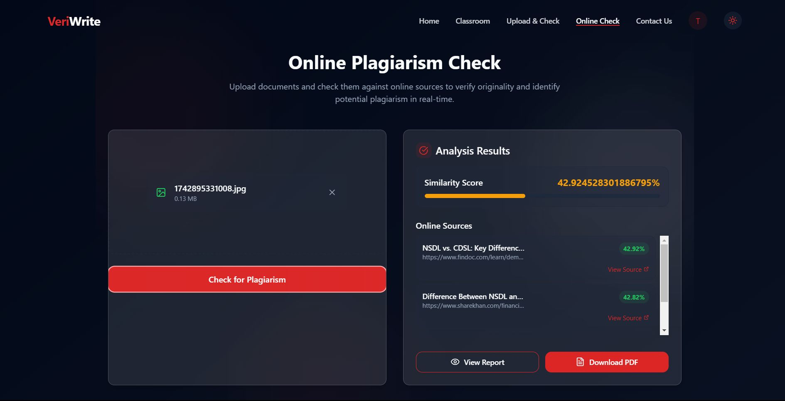

# ✍️ VeriWrite — Intelligent Plagiarism & Originality Detection System

**VeriWrite** is an innovative, full-stack web-based platform engineered to provide a robust solution for detecting plagiarism and ensuring content originality. While initially focused on academic submissions, its core capabilities extend to general document verification. It leverages a sophisticated blend of text extraction, advanced similarity detection algorithms, and real-time web content comparison to generate insightful, detailed plagiarism reports. VeriWrite aims to empower educators and content creators, preserve academic integrity, and streamline the evaluation process.

---

## 🚀 Live Demo & Visual Showcase

Experience VeriWrite live and see its core functionalities in action!

🔗 **Live Demo:** [**https://veriwrite.vercel.app/**]

---

### Key User Interfaces:

#### Online Plagiarism Check Interface

*A clean interface for uploading documents and initiating plagiarism checks against online sources.*

#### How It Works - Workflow Overview

*A visual representation of VeriWrite's streamlined process: Upload, Analyze, Review.*

#### Document Upload & Analysis View

*Showcasing the drag-and-drop functionality and immediate feedback on file processing.*

---

## ✨ Core Features & Innovations

* **Comprehensive Document Input:**
    * Supports multi-format uploads including **PDFs, Word Documents (DOCX/DOC), and various image files (JPG, JPEG, PNG)**.
    * **Intelligent Text Extraction:** Employs **Microsoft Azure OCR API** for highly accurate text extraction from image-based content and scanned documents (including handwritten text). Features a robust **fallback mechanism for PDFs**: if standard PDF parsing yields no or minimal text, it automatically switches to OCR to ensure comprehensive text capture.
* **High-Performance Plagiarism Engine:**
    * **Optimized Comparison:** Architected a plagiarism core that achieves a remarkable **95% reduction in pairwise comparison overhead** by implementing advanced techniques like **MinHash** and **Locality Sensitive Hashing (LSH)**. This ensures rapid and scalable analysis, even with large datasets.
    * **Accurate Similarity Scoring:** Utilizes **Jaccard-Overlap token scoring** for precise measurement of content similarity.
* **Real-time Online Plagiarism Check:**
    * Integrates with **SERP API** to compare uploaded content against billions of live web pages, providing dynamic and comprehensive online matching.
* **Detailed & Actionable Reports:**
    * Auto-generates **grouped plagiarism reports** for submissions with high similarity.
    * Reports include **highlighted matches, a clear similarity score breakdown**, and options for **in-browser viewing and PDF download**.
* **Secure Virtual Classroom System:**
    * Features **role-based access control (RBAC)** for teachers and students.
    * Teachers can **create assignments and exams, set deadlines, and track submissions**.
    * Students can **upload their assignments**, with late submission handling.
    * All submissions are seamlessly mapped to specific classes and user IDs.
* **Secure Authentication:** Robust user authentication system supporting both **Email/Password** and **Google OAuth**.
* **Intuitive User Dashboards:** Dedicated dashboards for both teachers and students, providing organized views of courses, assignments, submissions, and plagiarism results.

---

## 🖥️ Tech Stack

| Layer          | Technologies Used                                                                                                                                                                                      |
| :------------- | :----------------------------------------------------------------------------------------------------------------------------------------------------------------------------------------------------- |
| **Frontend** | React.js, Tailwind CSS (for modern UI/UX and custom animations), HTML/CSS (UI components)                                                                                                                |
| **Backend** | Node.js, Express.js (RESTful API development)                                                                                                                                                           |
| **Database** | MongoDB (via Mongoose ORM)                                                                                                                                                                             |
| **Algorithms** | MinHash, Locality Sensitive Hashing (LSH), Jaccard-Overlap, N-grams/Shingles                                                                                                                           |
| **APIs/Services** | Microsoft Azure OCR API, SERP API                                                                                                                                                                      |
| **Authentication** | JSON Web Tokens (JWT), Google OAuth 2.0                                                                                                                                                                |
| **File Handling** | Multer, PDF-Parse, Mammoth.js, Node's `fs` module                                                                                                                                                      |
| **Deployment** | Vercel (for Frontend), Render (for Backend)                                                                                                                                                            |

---

## 🛠️ Installation & Setup

To get VeriWrite up and running on your local machine, follow these steps:

```bash
# 1. Clone the repository
git clone [https://github.com/yourusername/veriwrite.git](https://github.com/yourusername/veriwrite.git)
cd veriwrite

# 2. Install Frontend Dependencies & Start
cd frontend
npm install # or yarn install
npm start   # or yarn start

# 3. Install Backend Dependencies & Start
cd ../backend
npm install # or yarn install
npm run dev # or npm start (if your package.json uses 'start' for dev)
````

🔑 **Environment Variables (`.env` files):**
Ensure you create `.env` files in both your `frontend` and `backend` directories. Refer to the `.env.example` (or similar) files within those folders for required variables such as:

  * `MONGODB_URI`
  * `JWT_SECRET`
  * `AZURE_OCR_ENDPOINT`, `AZURE_OCR_KEY`
  * `SERP_API_KEY`
  * `VITE_API_BASE_URL` (for frontend)

-----

## 🧪 How It Works (Core Plagiarism Flow)

1.  **Student Upload:** A student uploads an assignment (PDF, DOCX, image).
2.  **Text Extraction:**
      * For PDFs, `pdf-parse` attempts extraction. If minimal/no text, **Azure OCR** is used as a fallback.
      * For Word Docs, `mammoth.js` extracts raw text.
      * For images, **Azure OCR** extracts text.
3.  **Preprocessing & Shingling:** The extracted text is normalized, tokenized, and converted into 'shingles' (fixed-size word sequences).
4.  **MinHash Signature Generation:** Each document's shingles are used to generate a compact **MinHash signature**.
5.  **Locality Sensitive Hashing (LSH):** Signatures are partitioned into bands and hashed, allowing for efficient candidate pair identification (documents likely to be similar) without N^2 comparisons. This is where the **95% overhead reduction** is achieved.
6.  **Jaccard Similarity Calculation:** For candidate pairs, the **Jaccard similarity** of their original shingle sets (or MinHash signatures) is calculated to determine the precise degree of overlap.
7.  **Online Comparison (SERP API):** For the "Online Plagiarism Check," extracted text segments are queried against web content via the SERP API.
8.  **Report Generation:** A detailed PDF report is compiled, grouping similar submissions and highlighting plagiarized sections.

-----

## 📌 Future Improvements

  * **Automated Assignment/Exam Evaluation:** Integrate AI/ML models for automatic grading of exams or assignments based on teacher's model answers, extending beyond just plagiarism detection.
  * **Semantic Plagiarism Detection:** Implement advanced NLP techniques (e.g., using **BERT embeddings**) to detect conceptual or rephrased plagiarism, rather than just exact string matches.
  * **Fine-tuned OCR:** Integrate and fine-tune models like **Tesseract** for even more precise text extraction, particularly for diverse handwritten styles or specialized document types.
  * **AI-driven Feedback:** Provide AI-generated constructive feedback on student submissions.

-----

## 👥 Team VeriWrite

  * Sidharth P (https://github.com/Sid-CodeX)
  * Rahul Koshy Manoj (https://github.com/RAHULKOSHY)
  * Mariya Jose (https://github.com/maria-jose-2004)
  * Archana Mukundan (https://github.com/ArchanaMukundhan)

Proudly developed as part of a 6th-semester Mini Project at Muthoot Institute of Technology and Science (MITS), under the esteemed guidance of Dr. Sreenu G, CSE Department.

-----

## 📄 License

This project is licensed under the [MIT License](https://www.google.com/search?q=LICENSE).

-----

## 🤝 Contributing

We welcome contributions\! Feel free to fork this repository, suggest enhancements via issues, or submit pull requests. For major changes, please open an issue first to discuss what you would like to change.

-----

## 📬 Contact Us

Have feedback or questions? Reach out via [GitHub Issues](https://github.com/sidharthp-2004/veriwrite/issues) or connect with any team member on LinkedIn.

-----

Engineered with precision and passion by **Team VeriWrite**

```
